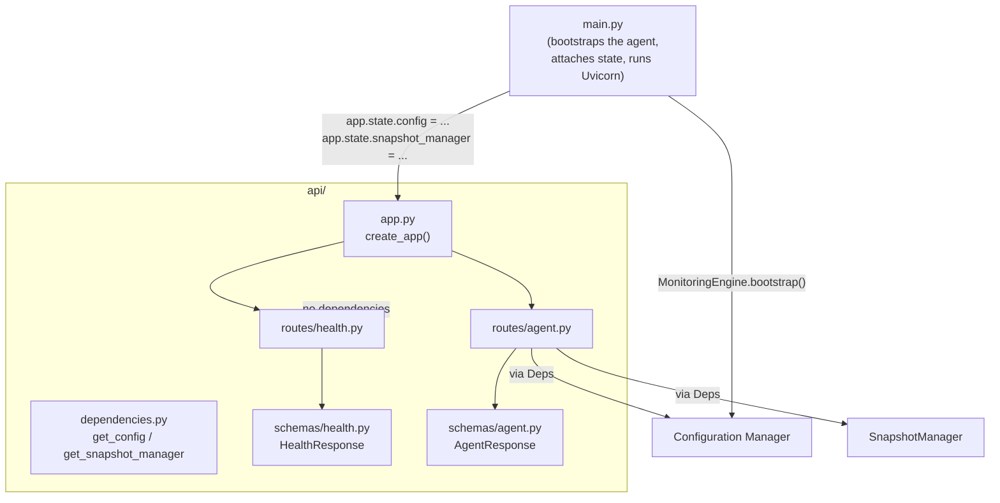

# API Foundation

`api/` — implemented. The FastAPI-based HTTP interface for the Linux Insight Agent: `api/app.py` builds the application, `api/dependencies.py` provides access to the agent's shared state, and `api/routes/` + `api/schemas/` implement the endpoints and their response models.

## Purpose

The API exists to expose a read-only view of the agent's own state over HTTP, without becoming a second source of truth for it. Every value an endpoint returns already exists somewhere else in the agent — in the loaded [Configuration](configuration.md), or in the latest snapshot held by the [Snapshot Manager](snapshot.md) — the API only ever reads and reshapes those values into HTTP responses; it never collects, schedules, or computes anything itself.

This keeps the API decoupled from how monitoring actually happens: it has no dependency on `Monitor`, `Scheduler`, or any collector, and no route or dependency in `api/` imports any of them. As already noted in the [Unified Monitoring Engine](unified-monitoring-engine.md#future-enhancements) documentation, this is precisely what makes an HTTP layer like this possible to add without changing `Monitor`, `Scheduler`, `SnapshotManager`, or the Configuration Manager at all.

## Architecture



`api/app.py` builds the `FastAPI` application and registers routers; it holds no monitoring state itself. The actual `Config` and `SnapshotManager` instances a running agent uses are attached to `app.state` by [`main.py`](../main.py) at startup — `api/` on its own only defines *how* to reach that state once it's there (see [Dependency Injection](#dependency-injection)), not where it comes from.

## Folder Structure

```
api/
├── __init__.py
├── app.py                 # FastAPI application factory; registers routers
├── dependencies.py        # Dependency providers: get_config, get_snapshot_manager
├── routes/
│   ├── __init__.py
│   ├── health.py           # GET /health
│   └── agent.py            # GET /agent
└── schemas/
    ├── __init__.py
    ├── health.py            # HealthResponse
    └── agent.py             # AgentResponse
```

Routes and schemas are deliberately kept in separate packages: a `routes/*.py` module defines *behavior* (an endpoint function, wired to a path and a response model), while the matching `schemas/*.py` module defines *shape* (the Pydantic model describing that response) — each route module imports its one corresponding schema module, never the other way around.

## Dependency Injection

Every route reaches shared agent state exclusively through the dependency providers in `api/dependencies.py`, never by constructing anything itself:

- `get_config(request)` and `get_snapshot_manager(request)` both read a single attribute off `request.app.state` and return it as-is. Neither constructs, owns, or caches the object it returns.
- `ConfigDependency` and `SnapshotManagerDependency` are `Annotated` aliases wrapping those two functions in `Depends(...)`, so a route parameter can simply be typed `config: ConfigDependency` instead of repeating `Depends(get_config)` everywhere.
- If the expected attribute is missing from `request.app.state`, or isn't an instance of the expected type, the provider raises `RuntimeError` immediately, with a message naming exactly what's missing — rather than surfacing a bare `AttributeError` from deep inside Starlette.

This design holds no state in `api/` itself: `request.app.state.config` and `request.app.state.snapshot_manager` are attached once, by `main.py`, when the agent starts (see [Startup Sequence](unified-monitoring-engine.md#startup-sequence) for how `MonitoringEngine` produces the `Config` and `SnapshotManager` in the first place). Every request afterward reads whatever is currently attached — there is no module-level singleton in `api/dependencies.py` that could drift out of sync with the running agent, or that would need special handling in tests.

## Health Endpoint

`GET /health` (mounted at `/api/v1/health` — see [API Versioning](#api-versioning)) is a pure liveness check: it reports that the API process itself is up and can respond, and nothing more.

- Response model: `HealthResponse` (`status`, `service`, `version`, `timestamp`).
- `status` is typed `Literal["healthy"]` — it is the only value this endpoint can ever return in a `200` response, since it performs no dependency checks of any kind.
- Takes no dependencies at all: no `Config`, no `SnapshotManager`. It performs no I/O beyond generating the current UTC timestamp.
- Always returns `200 OK`. If the process can't respond, there is no response to observe — which is the point of a liveness check.

## Agent Endpoint

`GET /agent` (mounted at `/api/v1/agent`) reports the agent's configured identity together with a small amount of state from its most recent monitoring cycle.

- Response model: `AgentResponse` (`agent_id`, `hostname`, `platform`, `api_version`, `scheduler_interval`, `status`).
- `agent_id`, `hostname`, and `scheduler_interval` come from `ConfigDependency` — available as soon as configuration has loaded, independent of whether any monitoring cycle has run yet.
- `platform` and `status` come from `SnapshotManagerDependency`'s latest snapshot instead, since configuration alone can't answer either:
  - `platform` degrades to `null` if no snapshot exists yet, or the `system_info` collector wasn't enabled for that cycle.
  - `status` mirrors the snapshot's own `monitoring.status` (`"success"` / `"partial_success"`), or reports `"unknown"` if no monitoring cycle has completed yet.
- Both dependencies are read once per request; the endpoint never mutates either.

## API Versioning

Every router is mounted under a shared `/api/v1` prefix, applied once, in `api/app.py`'s `create_app()`, at the point each router is included — never baked into an individual router's own path definitions (`routes/health.py` defines its path as plain `/health`, not `/api/v1/health`).

Keeping the prefix external to the route modules means a future `/api/v2` could be introduced by including the same routers again under a different prefix (or a modified set of them), without editing `routes/health.py` or `routes/agent.py` at all — versioning is a composition-time concern, decided in exactly one place.

## Current Limitations

- **Only two endpoints exist.** `/health` and `/agent` are the entire surface today; no endpoint yet exposes anything beyond the small, summary-level fields each of those two returns.
- **No authentication or authorization.** Every endpoint is open to anyone who can reach the process.
- **Request/response only.** There is no mechanism for the API to push updates to a client — a client must issue a new request to see newer data.
- **Single process, in-memory only.** The `Config` and `SnapshotManager` an endpoint reads are whatever `main.py` attached to `app.state` in this one process; there is no cross-process or cross-host aggregation.
- **No rate limiting or response caching.** Every request re-reads `app.state` directly; there is no throttling or short-lived caching layer in front of it.
- **`/health` checks nothing but itself.** It reports process liveness only — it does not check whether `Config` or `SnapshotManager` are actually attached to `app.state`, or whether the Scheduler is currently running.

## Future Endpoints

- An endpoint exposing full monitoring/collector-level data, beyond the summary fields `/agent` currently reports.
- Authentication and authorization for all endpoints.
- A way for clients to receive updates as they happen, rather than only by polling.
- Historical or time-ranged data, rather than only the latest snapshot.
- A readiness check (distinct from `/health`'s liveness check) that reports whether `Config` and `SnapshotManager` are properly attached and the Scheduler is running.
