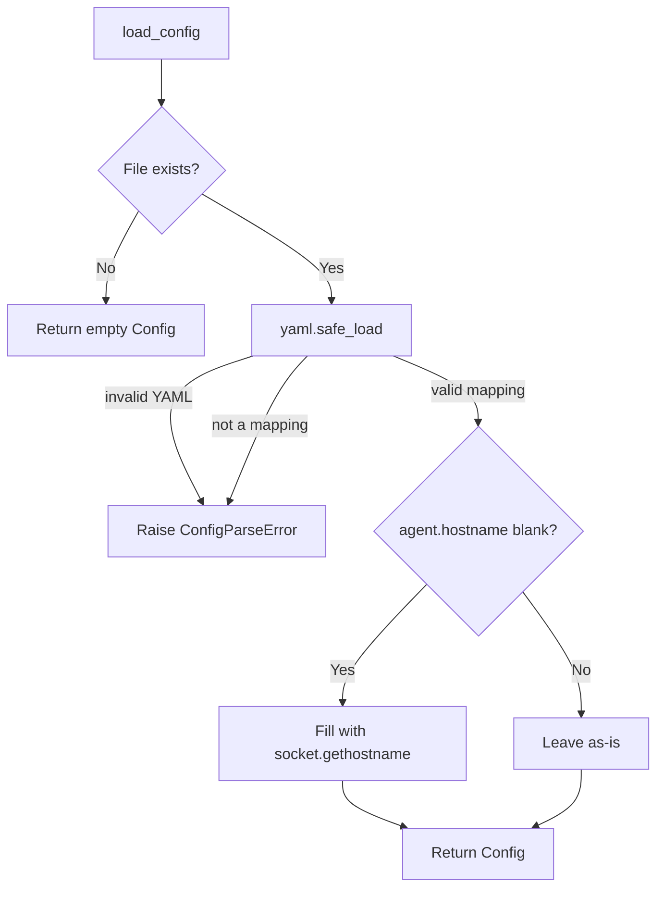

# Configuration

`config/config_loader.py` and `config/validator.py` — implemented. Together they form the **Configuration Manager**: `config_loader` reads `config.yaml` from disk into a `Config` object, and `validator` checks that `Config` for the specific values the rest of the agent depends on being present and well-formed, before anything else is built from it.

## Purpose

The Configuration Manager exists to give the agent one place to read runtime settings from — an agent's identity, how often it monitors the host, and which collectors it runs — without any other module needing to know how those settings are stored, parsed, or checked. It draws a clear line between two separate concerns:

- **Reading** configuration (`config_loader.py`): turning `config.yaml` into a `Config` object, handling a missing file or malformed YAML.
- **Validating** configuration (`validator.py`): checking that a `Config` object's values are actually usable, and raising a specific, descriptive exception the moment one isn't.

Neither module starts, constructs, or configures any other part of the agent. Reading and validating configuration is the extent of what the Configuration Manager does — using the values it produces (e.g. injecting a refresh interval into a [Scheduler](scheduler.md)) is left entirely to the caller.

## Configuration Structure

Configuration lives in a single file, `config.yaml`, at the agent root (alongside `main.py`). It has three top-level sections:

```yaml
agent:
  id: ""
  hostname: ""
  location: ""

scheduler:
  refresh_interval: 30

monitoring:
  enabled_collectors:
    - system_info
    - cpu
    - memory
    - disk
    - network
    - process
```

- **`agent`** — identity of this agent instance: `id`, `hostname`, `location`.
- **`scheduler`** — pacing for the monitoring loop: `refresh_interval`.
- **`monitoring`** — which collectors to run: `enabled_collectors`.

Only settings the current implementation actually uses are present. New top-level sections can be added later, for features as they're built, without needing to change the sections already here.

## Loading Process

`load_config(path=None)` is the single entry point for reading configuration:

1. Resolve the file path — the given `path`, or `DEFAULT_CONFIG_PATH` (`config.yaml` at the agent root) if none was given.
2. If the file doesn't exist, return an empty `Config` immediately. A missing configuration file is not treated as an error at this stage — it's left to `validate_config` (or the caller) to decide whether that's acceptable.
3. Parse the file's contents with `yaml.safe_load`. Invalid YAML syntax raises `ConfigParseError`.
4. If parsing succeeds but the top level isn't a mapping (e.g. a YAML list), also raise `ConfigParseError` — configuration must be a set of key/value sections, not an arbitrary document.
5. Apply one loading-time convenience: if `agent.hostname` is missing, not a string, or blank, fill it in with `socket.gethostname()`. An explicitly-set hostname is never overwritten. This is the only value `config_loader` ever fills in or changes — every other field is returned exactly as parsed.
6. Wrap the resulting data in a `Config` and return it.



`config_loader` never validates *values* beyond that one hostname default — no field is checked for being the right type, non-empty, or otherwise sensible. That's `validator.py`'s job, run as a separate, explicit step afterward.

## Validation Rules

`validate_config(config)` performs exactly three checks, in order, and raises on the first one that fails — it never modifies `config` or the values within it.

| Order | Rule | Exception raised |
|---|---|---|
| 1 | `agent.id` must be a non-empty string. | `MissingAgentIDError` |
| 2 | `scheduler.refresh_interval` must be a positive integer (`bool` is explicitly rejected, even though it's technically an `int` subclass in Python). | `InvalidRefreshIntervalError` |
| 3 | `monitoring.enabled_collectors` must be a non-empty list of strings, and every name in it must match a collector that actually exists in the project. | `InvalidEnabledCollectorsError` (structural problems with the list itself) or `UnknownCollectorError` (a well-formed list naming a collector that doesn't exist) |

All four exceptions share a common base, `ValidationError`, so a caller that doesn't need to distinguish between failure reasons can catch just that one type.

`agent.hostname` and `agent.location` are **not** validated:

- `agent.hostname` is optional — by the time `validate_config` ever sees a `Config` produced by `load_config`, it's already guaranteed to hold a usable value (either what was configured, or the auto-detected hostname).
- `agent.location` is purely descriptive, with no constraint to enforce.

"Known collectors" is not a separately-maintained list — it's read directly from the [Monitor](monitor.md)'s own collector registry, so this check can never drift out of sync with the collectors that actually exist under `collectors/`.

## Current Supported Options

| Option | Type | Required | Default behavior | Description |
|---|---|---|---|---|
| `agent.id` | string | Yes | None — must be set explicitly, or `validate_config` raises. | Stable, unique identifier for this agent instance. |
| `agent.hostname` | string | No | Auto-filled with `socket.gethostname()` at load time if blank or omitted. | Network hostname of the monitored host; set explicitly only to override detection. |
| `agent.location` | string | No | Left as whatever is configured (often blank); never validated. | Free-form, human-readable label for this host's location. |
| `scheduler.refresh_interval` | positive integer | Yes | None — must be set explicitly, or `validate_config` raises. | Seconds between the end of one [Scheduler](scheduler.md) cycle and the start of the next. |
| `monitoring.enabled_collectors` | list of strings | Yes | None — must be set explicitly, or `validate_config` raises. | Which collectors the [Monitor](monitor.md) runs; every name must match an existing collector. |

## Future Enhancements

- Overriding individual configuration values via environment variables, for deployment environments where editing `config.yaml` directly isn't convenient.
- Reloading configuration while the agent is running, rather than only ever reading it once at startup.
- Type and range checks on `agent.location` and other currently-unconstrained fields, if a real need for them emerges.
- Support for splitting configuration across multiple files or layering a shared base file with host-specific overrides.
- A standalone command to validate a `config.yaml` file without starting the agent, for catching mistakes before deployment.
