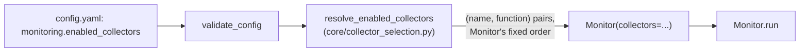
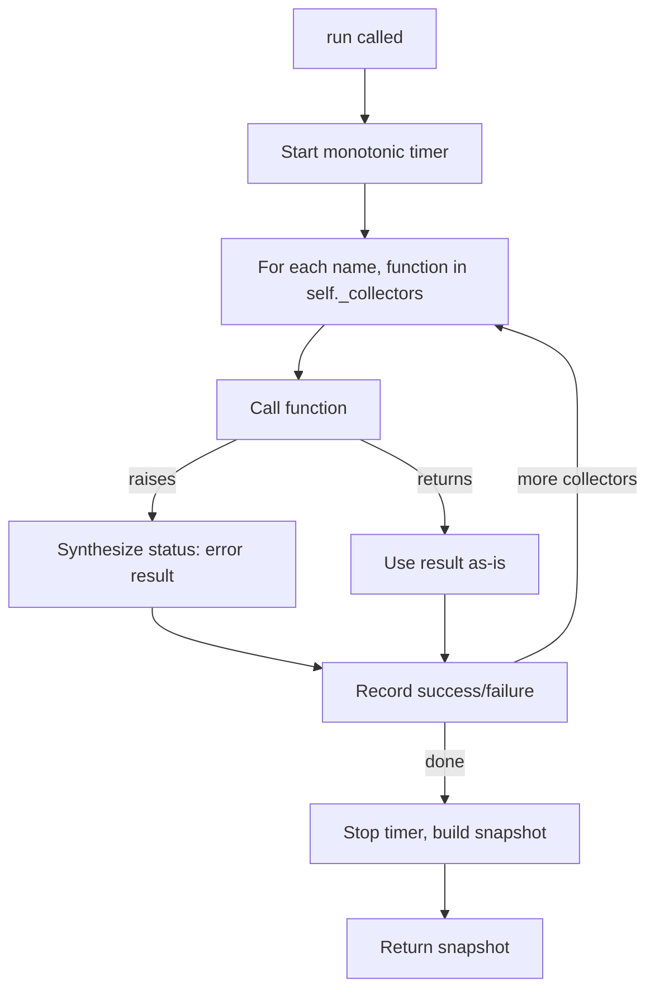

# Monitor

`core/monitor.py` — implemented. Defines the `Monitor` class, which orchestrates a set of [collectors](system-info.md) into one unified snapshot of the host, in a fixed order, once per call to `run()`.

## Purpose

`Monitor` exists to turn several independent, single-purpose collector functions ([System Information](system-info.md), [CPU](cpu.md), [Memory](memory.md), [Disk](disk.md), [Network](network.md), [Process](process.md)) into one coherent, point-in-time reading of the whole host — a single dictionary a caller can request, store, or forward, without needing to know that reading is actually the combined output of several separate collectors.

## Responsibilities

`Monitor` is responsible for, and only for:

- Running each of its collectors, in a fixed order, exactly once per call to `run()`.
- Isolating each collector's failure — whether it returns a non-`"success"` status or raises an unhandled exception — so one broken collector never stops the rest from running.
- Assembling every collector's output, plus cycle-level metadata (timestamp, execution time) and a pass/fail summary, into one snapshot dictionary.

It is explicitly **not** responsible for: scheduling itself on an interval (that's the [Scheduler](scheduler.md)'s job), storing or retaining any snapshot after returning it (that's the [Snapshot Manager](snapshot.md)'s job), or deciding *which* collectors should be enabled based on configuration (that's the composition layer's job — see [Collector Selection](#collector-selection) below). `Monitor` also holds no mutable state between calls — each `run()` is a fully independent cycle.

## Architecture

```
Monitor
├── _COLLECTORS: Tuple[(name, function), ...]   # class-level; every collector that exists
└── _collectors: Tuple[(name, function), ...]   # instance-level; what THIS instance runs
```

`_COLLECTORS` is the full, fixed registry of every collector in the project, in the canonical order `system_info -> cpu -> memory -> disk -> network -> process`. It never changes based on configuration or on any particular `Monitor` instance.

`_collectors` is what a given instance actually iterates over in `run()`. By default (`Monitor()`, no arguments) it's set to exactly `_COLLECTORS` — every collector, reproducing `Monitor`'s original, unconditional behavior. An instance can instead be constructed with a narrower list (`Monitor(collectors=subset)`), in which case `run()` only executes that subset.

Critically, `Monitor` treats `collectors` as plain `(name, function)` pairs — it has no idea whether that list is the full registry or a filtered subset, or why. It never imports `config.yaml`, never imports anything from the `config` package, and has no notion that a Configuration Manager exists.

## Collector Selection

`monitoring.enabled_collectors` (see [Configuration](configuration.md)) controls which collectors actually run — but `Monitor` itself never reads that setting. Instead, filtering happens entirely at the composition layer, one level above `Monitor`:

1. [`config.validator.validate_config`](configuration.md#validation-rules) confirms `monitoring.enabled_collectors` is a non-empty list of collector names that all exist.
2. `core.collector_selection.resolve_enabled_collectors(names)` cross-references those names against `Monitor._COLLECTORS` and returns the matching `(name, function)` pairs — in `Monitor`'s own fixed order, never the order configuration lists them in. A name that doesn't match any known collector raises `UnknownCollectorError`; if resolving leaves nothing to run, it raises `InvalidEnabledCollectorsError` instead of allowing an empty monitoring cycle.
3. [`core.engine.MonitoringEngine.from_config`](configuration.md) passes the resolved list into `Monitor(collectors=resolved)` — plain constructor injection.



A disabled collector is ignored completely — it never runs, and it never appears anywhere in the resulting snapshot (not even as a failed or skipped entry). Enabling only `cpu` and `memory`, for example, produces a snapshot whose `"collectors"` section contains exactly those two keys, and whose `total_collectors` count reflects only that subset.

This keeps `Monitor` unaware of configuration entirely: it only ever receives a plain list of functions to call, exactly the same way whether that list came from its own default registry or was filtered down by `resolve_enabled_collectors` beforehand.

## Execution Flow

Each call to `run()`:

1. Starts a monotonic-clock timer, for the cycle's total execution time.
2. Iterates this instance's collectors, in order. For each one, calls it inside a guard that converts any unexpected exception into a synthesized `"status": "error"` result — so a bug in one collector can never abort the cycle.
3. Tracks which collectors reported their own `"status": "success"` versus which didn't (a different status, or a synthesized error).
4. Stops the timer, and assembles everything into one snapshot dictionary.



## Public Interface

| Member | Signature | Description |
|---|---|---|
| `__init__` | `(collectors: Optional[Sequence[Tuple[str, CollectorFunction]]] = None) -> None` | Creates a `Monitor`. Defaults to the full collector registry; accepts a narrower, pre-resolved list via dependency injection. |
| `run` | `() -> Dict[str, object]` | Runs one full monitoring cycle across this instance's collectors and returns the resulting snapshot. |

## Snapshot Shape

```python
{
    "metadata": {
        "timestamp": "2026-07-27T12:00:00+00:00",
        "execution_time_seconds": 0.42,
    },
    "summary": {
        "overall_status": "success",
        "total_collectors": 6,
        "successful_collectors": ["system_info", "cpu", "memory", "disk", "network", "process"],
        "failed_collectors": [],
    },
    "monitoring": {
        "status": "success",
        "execution_time": 0.42,
        "successful_collectors": 6,
        "failed_collectors": 0,
        "total_collectors": 6,
    },
    "collectors": {
        "system_info": {"...": "each collector's own envelope"},
        "cpu": {"...": "..."},
        "...": "...",
    },
}
```

`total_collectors`, the entries under `"collectors"`, and the name lists in `"summary"` all reflect only the collectors this particular instance was constructed to run — a `Monitor` built with a two-collector subset reports `total_collectors: 2` and a `"collectors"` dictionary with exactly two keys, not six.

## Error Handling

Every collector already handles its own internal failures gracefully (falling back to `"Unknown"`/empty values and reporting them in its own `errors` list rather than raising). `Monitor._run_collector` exists only as a second layer of defense, for whatever a collector's own error handling didn't anticipate — it converts any unexpected exception into a minimal `{"collector", "status": "error", "data": {}, "errors": [...]}` envelope, so the rest of the cycle is unaffected.

## Current Limitations

- **No parallelism.** Collectors run strictly sequentially; a slow collector delays the whole cycle.
- **No caching.** Every `run()` re-collects everything from scratch, even data that changes rarely (e.g. system identity).
- **No retry logic.** A collector that fails once fails for that cycle; there's no backoff or re-attempt within a single `run()`.

## Future Enhancements

- Optional parallel collector execution, for hosts where sequential collection takes long enough to matter.
- Caching rarely-changing collector output (e.g. system identity) across cycles.
- Per-collector timeouts, so one slow collector can't stall an entire cycle indefinitely.
