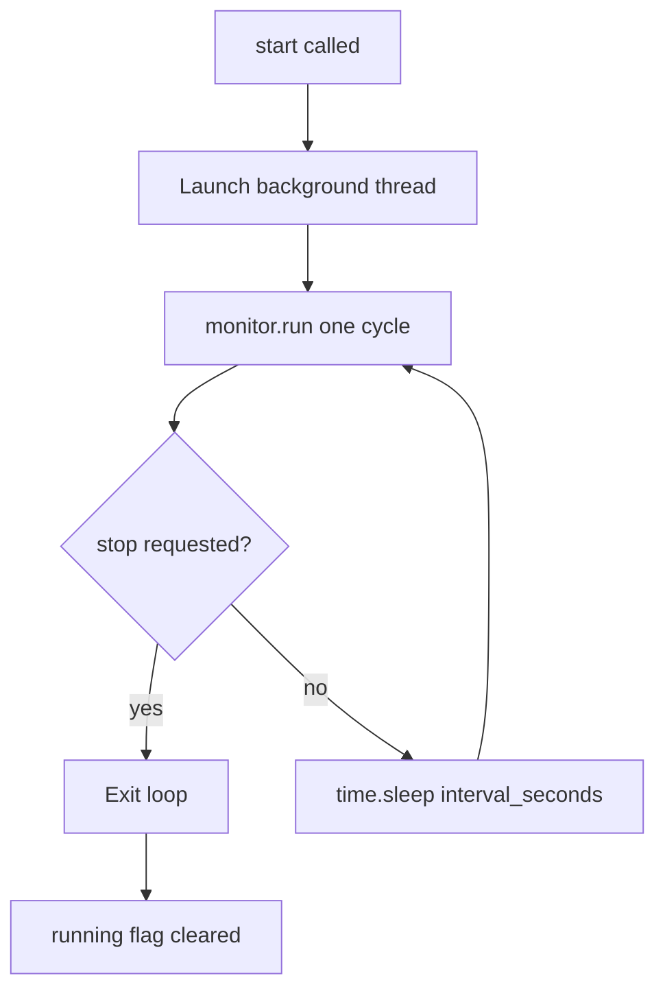

# Scheduler

`core/scheduler.py` — implemented. Defines the `Scheduler` class, which periodically executes the [Monitor](monitor.md) on a fixed interval, in a background thread, until explicitly stopped.

## Purpose

The Scheduler is responsible for **one thing only**: periodically executing the `Monitor` it is given, on a fixed interval, without blocking the caller. It contains no collection, aggregation, storage, or reporting logic of its own — all of that lives in `Monitor` and the collectors it orchestrates. The Scheduler's entire job is pacing repeated execution.

## Responsibilities

`Scheduler` is responsible for, and only for:

- Accepting a `Monitor` instance and a fixed refresh interval (in seconds) at construction time.
- Repeatedly calling `monitor.run()` on that interval, in a background thread, once started.
- Returning control to the caller immediately on `start()` — the caller is never blocked waiting for a monitoring cycle.
- Guaranteeing that at most one `Scheduler` is actively running per process at a time.
- Providing a graceful `stop()` that waits for the background loop to fully exit before returning.
- Exposing its own current running state via `is_running()`.

It is explicitly **not** responsible for: what happens inside a monitoring cycle (that's entirely `Monitor`'s concern), storing, forwarding, or exposing the snapshots each cycle produces, reacting differently to a `"success"` vs. `"partial_success"` result, or anything resembling scheduling policy beyond a single fixed interval (no cron expressions, no jitter, no backoff).

## Architecture

`Scheduler` wraps a `Monitor` instance supplied by the caller — it never constructs, modifies, or reconfigures it. This is a plain dependency: the Scheduler's only interaction with the Monitor is calling `monitor.run()` once per cycle and discarding the return value.

```
Scheduler
├── monitor: Monitor              # injected, never modified
├── interval_seconds: float       # fixed refresh interval
├── _stop_event: threading.Event  # signals the loop to stop
├── _thread: threading.Thread     # background loop, once started
└── _running: bool                # explicit running-state flag
```

There is no persistence layer, no configuration file, and no external service dependency — the entire class is self-contained in `core/scheduler.py` and depends only on the standard library (`threading`, `time`) plus `Monitor`'s public interface.

## Execution Flow

1. **`start()`** validates that this instance (and no other `Scheduler` instance in the process) is already running, then launches a background `threading.Thread` running the internal loop, and returns immediately.
2. **The background loop**, once running, repeats:
   1. Call `monitor.run()` — one full monitoring cycle.
   2. Discard its result (the Scheduler never inspects or stores it).
   3. Check whether `stop()` has been requested; if so, exit the loop.
   4. Otherwise, `time.sleep(interval_seconds)`.
   5. Repeat from step 1.
3. **`stop()`** signals the loop to stop, then blocks until the background thread has fully exited before returning to the caller.



## Public Interface

| Member | Signature | Description |
|---|---|---|
| `__init__` | `Scheduler(monitor: Monitor, interval_seconds: float)` | Creates a Scheduler for the given `Monitor`, using a fixed refresh interval. Raises `ValueError` if `interval_seconds` is not positive. |
| `start()` | `-> None` | Starts the background monitoring loop and returns immediately. Raises `RuntimeError` if this (or any other) `Scheduler` instance is already running in the process. |
| `stop()` | `-> None` | Signals the loop to stop and blocks until it has fully exited. Safe to call even if never started, or already stopped. |
| `is_running()` | `-> bool` | Reports whether the background loop is currently active. |

## Threading Model

- The monitoring loop runs on exactly one background `threading.Thread`, created fresh by each `start()` call and marked `daemon=True` (so it can never prevent the process from exiting on its own).
- A `threading.Event` (`_stop_event`) is the sole stop signal between the caller and the background loop — `stop()` sets it; the loop checks it before and after each cycle.
- An explicit `_running` boolean, separate from the stop event, tracks whether the loop is actually active. It's set by the background thread itself at the start and end of its run (in a `finally` block, so it's always accurate even if something inside the loop misbehaves), and read through `is_running()`.
- A process-wide class-level lock and a class-level "active scheduler" slot enforce that only one `Scheduler` instance — across all instances, not just this one — can be running at any given time; a `start()` call that would violate this raises `RuntimeError` instead of silently starting a second, competing loop.
- A per-instance lock guards `_running` and the "already running" check in `start()`, so concurrent calls from different threads can't race past the check.

## Current Limitations

- **Fixed interval only.** There is no support for cron-style schedules, variable/adaptive intervals, or jitter between cycles — every gap between cycles is exactly `interval_seconds`.
- **`stop()` is not instant.** Because the pacing between cycles is a plain `time.sleep(interval_seconds)` rather than an interruptible wait, `stop()` can take up to one full interval to return if it's called while the background thread is mid-sleep — it will always return once that sleep completes and the loop observes the stop signal, but not sooner.
- **No visibility into individual cycles.** Each cycle's result is discarded immediately after `monitor.run()` returns. The Scheduler itself has no way to report a cycle's status, execution time, or failures — a caller that needs this must wrap `monitor.run` itself (as the project's test script does) rather than relying on anything the Scheduler exposes.
- **One active scheduler per process, not per Monitor.** The "only one running at a time" rule is process-wide, so two different `Monitor` instances cannot be scheduled concurrently via two `Scheduler` instances in the same process.
- **Failures inside a cycle are silently absorbed.** If `monitor.run()` raises unexpectedly, the loop continues to the next cycle without recording or surfacing the failure in any way — this keeps the Scheduler resilient, but means such a failure is otherwise invisible.

## Future Enhancements

- An interruptible wait (e.g. checking the stop event on a short polling interval, or waking early on a dedicated signal) so `stop()` can return promptly instead of waiting out the current sleep.
- A callback or observer hook so a caller can react to each cycle's result without needing to wrap `monitor.run` itself.
- Configurable behavior on repeated cycle failures (e.g. backing off the interval after consecutive failures), rather than always retrying at the same fixed cadence.
- Relaxing the current one-active-scheduler-per-process constraint, if a future use case within this same agent process genuinely needs more than one independent monitoring loop running locally at once.
