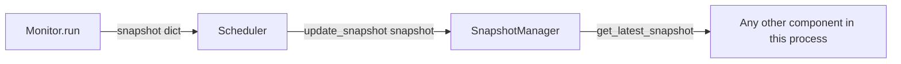
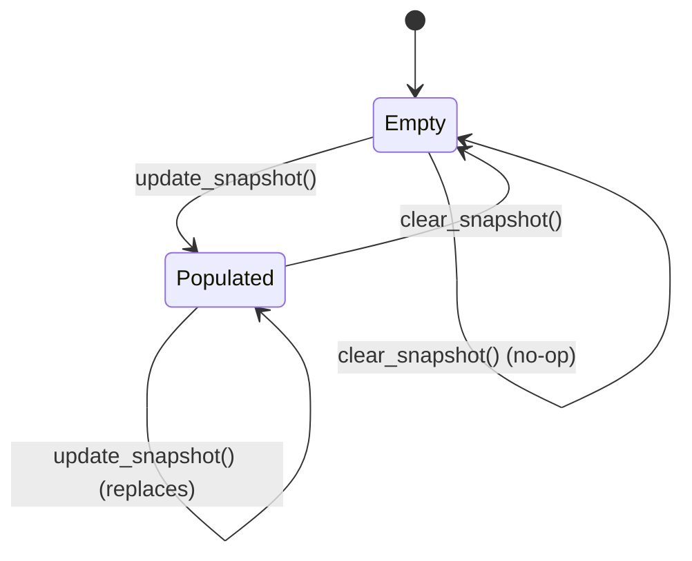

# Snapshot Manager

`core/snapshot.py` — implemented. Defines the `SnapshotManager` class, a thread-safe, in-memory holder for exactly one snapshot at a time — the most recent one produced by the [Monitor](monitor.md), delivered via the [Scheduler](scheduler.md).

## Purpose

`SnapshotManager` exists to give the agent process a single, consistent place to read "the current state of the host" — without needing to know how or when that state was produced. It decouples *producing* a snapshot (the `Monitor`'s job, on a schedule driven by the `Scheduler`) from *reading* the latest one (any other part of the process), so those two concerns never need to interact directly.

## Responsibilities

`SnapshotManager` is responsible for, and only for:

- Storing exactly one snapshot in memory at a time.
- Replacing the stored snapshot whenever a newer one is provided via `update_snapshot()`.
- Returning the latest stored snapshot, or reporting that none exists.
- Returning the latest snapshot's timestamp on request.
- Allowing the stored snapshot to be explicitly discarded.
- Guaranteeing that all of the above is safe to call concurrently from multiple threads.

It is explicitly **not** responsible for: producing snapshots (that's `Monitor`'s job), deciding when to update (that's the `Scheduler`'s job — see [Data Flow](#data-flow)), validating a snapshot's contents beyond the one timestamp lookup it needs for `get_snapshot_timestamp()`, retaining any history of previous snapshots, or persisting anything beyond the lifetime of the running process.

## Architecture

`SnapshotManager` is a small, self-contained class with no dependency on `Monitor` or `Scheduler` — it treats whatever it's given as an opaque dictionary and depends only on the standard library.

```
SnapshotManager
├── _snapshot: Optional[Dict[str, object]]   # the one stored snapshot, or None
└── _lock: threading.Lock                    # guards all access to _snapshot
```

There is no persistence layer, no configuration, and no external service dependency. Both storing and reading go through `copy.deepcopy`, so the object held internally is never the same object a caller passed in or received back (see [Thread Safety](#thread-safety)).

## Data Flow

Only the `Scheduler` writes to `SnapshotManager`; any other component in the process only reads from it. The two never interact directly with each other — `SnapshotManager` is the sole hand-off point between them.

1. On each successful cycle, the `Scheduler` calls `monitor.run()` and gets back a snapshot dictionary.
2. The `Scheduler` immediately calls `snapshot_manager.update_snapshot(snapshot)` on the `SnapshotManager` instance it was given at construction (dependency injection — the `Scheduler` never creates its own `SnapshotManager`).
3. `update_snapshot()` replaces whatever was previously stored, atomically, under its lock.
4. Any other component in the same process — today, that's the project's manual test script; going forward, any component in this agent process that needs the current host state — retrieves it by calling `get_latest_snapshot()` (or checks `has_snapshot()` / `get_snapshot_timestamp()` first, if it needs to know whether or when data is available before reading it).



**Why only the latest snapshot is stored:** `SnapshotManager` models a *current state* view, not a history — each new snapshot fully supersedes the previous one, the same way a single "last known value" gauge works. This keeps the class simple, keeps memory usage constant regardless of how long the agent runs, and matches how the rest of the agent already treats a snapshot: as a complete, self-sufficient point-in-time reading (see [System Information](system-info.md)), not as one entry in a growing series.

## Thread Safety

Thread safety is required because `SnapshotManager` is written to and read from by different threads at the same time by design: the `Scheduler` updates it from its own background `threading.Thread` on a fixed interval, while the main thread (or any other component running in this process) may call `get_latest_snapshot()`, `has_snapshot()`, or `get_snapshot_timestamp()` at any moment, independent of that schedule. Without synchronization, a read could observe a snapshot mid-replacement.

- A single `threading.Lock` guards every read and write of the internal `_snapshot` reference — there is exactly one critical section, so there's no risk of inconsistent state between two pieces of internal data getting out of sync with each other.
- Both `update_snapshot()` and every getter that returns a snapshot use `copy.deepcopy`, so:
  - A caller mutating the dictionary they passed to `update_snapshot()` afterward can never alter what's stored.
  - A caller mutating what `get_latest_snapshot()` returned can never alter what's stored, or affect any other caller reading it.
- `update_snapshot()`'s developer-facing console line (see [`scheduler.md`](scheduler.md)) is printed *after* the lock is released, so the critical section stays limited to the actual store and isn't held any longer than necessary.

## Public Methods

| Method | Signature | Description |
|---|---|---|
| `update_snapshot` | `(snapshot: Dict[str, object]) -> None` | Stores a deep copy of `snapshot`, replacing whatever was stored before. |
| `get_latest_snapshot` | `() -> Optional[Dict[str, object]]` | Returns a deep copy of the stored snapshot, or `None` if nothing is stored. |
| `has_snapshot` | `() -> bool` | Reports whether a snapshot is currently stored. |
| `clear_snapshot` | `() -> None` | Discards the stored snapshot, if any. Safe to call when nothing is stored. |
| `get_snapshot_timestamp` | `() -> Optional[str]` | Returns `snapshot["metadata"]["timestamp"]` from the stored snapshot, or `None` if nothing is stored or that field is missing. |

## Snapshot Lifecycle



- **Empty** — the initial state after construction, and the state after `clear_snapshot()`. `has_snapshot()` is `False`; `get_latest_snapshot()` and `get_snapshot_timestamp()` both return `None`.
- **Populated** — the state after at least one `update_snapshot()` call. `has_snapshot()` is `True`; the getters return the most recent snapshot and its timestamp.
- Every `update_snapshot()` call while **Populated** replaces the snapshot in place — there is never more than one snapshot in memory at a time, and the previous one is discarded with no way to recover it.

## Current Limitations

- **No history.** Only the single latest snapshot is ever available — there is no way to retrieve a previous one once it's been replaced or cleared.
- **No cross-process or cross-restart persistence.** The stored snapshot lives only in this process's memory; it is gone if the process restarts.
- **No update notifications.** A reader has no way to be told when a new snapshot arrives — it must call `has_snapshot()` / `get_latest_snapshot()` / `get_snapshot_timestamp()` itself whenever it wants to check.
- **No content validation.** Beyond the one `metadata`/`timestamp` lookup `get_snapshot_timestamp()` performs, `SnapshotManager` never checks that a stored snapshot has any particular shape — a caller passing in something unexpected will simply get that same thing back.
- **The console line in `update_snapshot()` is developer-facing only.** It's a plain `print()` for feedback during testing, not a logging mechanism a real caller should depend on.

## Future Enhancements

- Retaining a short, bounded history of recent snapshots (not just the latest), so short-term trends could be compared without changing what "the latest snapshot" means.
- A change-notification mechanism (e.g. a callback or condition variable) so a reader can be woken when a new snapshot arrives, instead of polling `has_snapshot()`.
- Optional structural validation of an incoming snapshot before it's stored, so a malformed value is rejected rather than silently accepted.
- Exposing the age of the current snapshot (time elapsed since its timestamp) as a simple, computed convenience, rather than requiring every reader to compute it from `get_snapshot_timestamp()` itself.
