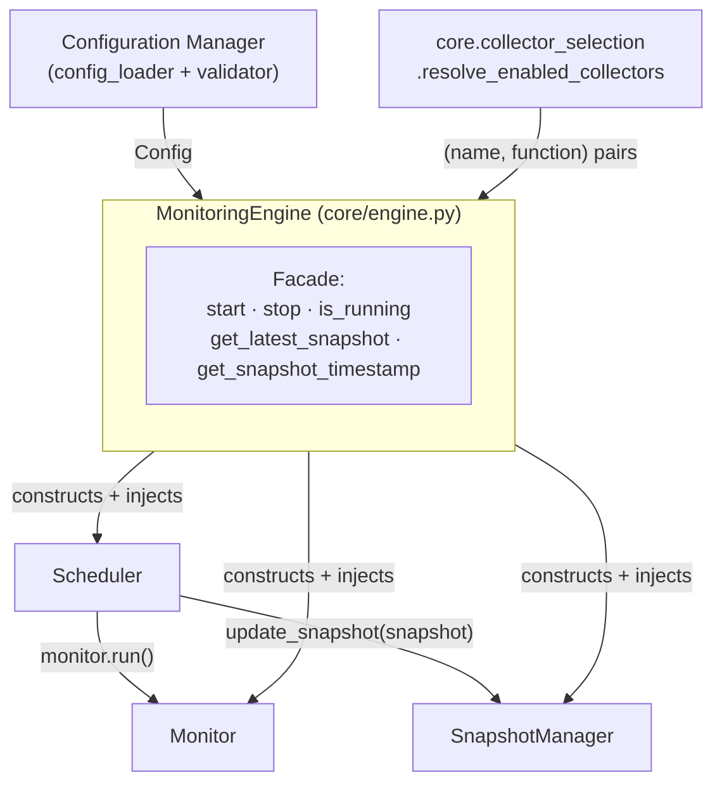
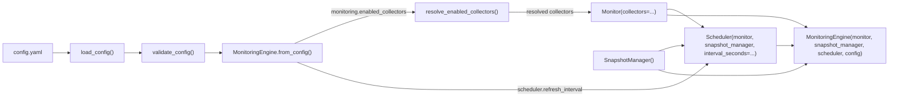

# Unified Monitoring Engine

`core/engine.py` — implemented. Defines `MonitoringEngine`, the composition layer that wires the [Configuration Manager](configuration.md), [Monitor](monitor.md), [Scheduler](scheduler.md), and [Snapshot Manager](snapshot.md) into a single, cohesive production entry point.

## Purpose

Before `MonitoringEngine` existed, anything that wanted to run the agent had to know how to build and wire all four pieces itself: load and validate configuration, resolve which collectors are enabled, construct a `Monitor` with that list, construct a `SnapshotManager`, construct a `Scheduler` with the `Monitor`, the `SnapshotManager`, and the configured interval injected — in the right order, every time.

`MonitoringEngine` exists so that wiring only has to be written once. It composes the four components via the dependency injection each of them already requires, and exposes a small facade (`start`, `stop`, `is_running`, `get_latest_snapshot`, `get_snapshot_timestamp`) so a caller — today, the [startup script](../main.py); potentially a future process entry point of any kind — never needs to construct or wire these pieces by hand, and never needs to know how any individual component works internally.

`MonitoringEngine` adds no monitoring behavior of its own. It has no collection logic, no scheduling logic, no storage logic, and no configuration-parsing logic — every one of those stays exactly where it already lived, in the component responsible for it.

## Overall Architecture



`MonitoringEngine` sits above all four components as a composition root: it is the only module in the project that imports and constructs `Monitor`, `SnapshotManager`, and `Scheduler` together, and the only module that calls both `config.config_loader.load_config` and `config.validator.validate_config` as part of building something else. None of the four components import `core.engine` — the dependency direction points one way, from the engine down to its collaborators, never back.

## Component Responsibilities

| Component | Responsible for | Not responsible for |
|---|---|---|
| Configuration Manager (`config_loader` + `validator`) | Reading `config.yaml`; validating the values the rest of the agent depends on. | Running, scheduling, or storing anything. |
| `core.collector_selection` | Resolving `monitoring.enabled_collectors` into concrete `(name, function)` pairs, in `Monitor`'s fixed order. | Reading configuration itself; running collectors. |
| `Monitor` | Running its collectors once per `run()` call and returning a snapshot. | Knowing configuration exists; scheduling itself; storing its own output. |
| `Scheduler` | Running a `Monitor` repeatedly, on a fixed interval, and forwarding each cycle's snapshot to a `SnapshotManager`. | Loading configuration; deciding which collectors run or how often, beyond the interval it's given. |
| `SnapshotManager` | Storing exactly the latest snapshot it's handed. | Producing or scheduling anything. |
| `MonitoringEngine` | Composing the above via dependency injection; exposing a small facade. | Everything the components above already do — the engine delegates every one of these calls without adding logic of its own. |

## Dependency Flow



Every value flows in one direction, from configuration down into the collaborator that needs it, always through a constructor argument:

- `monitoring.enabled_collectors` → `resolve_enabled_collectors()` → `Monitor(collectors=...)`.
- `scheduler.refresh_interval` → `Scheduler(..., interval_seconds=...)`.
- The freshly-built `Monitor` and `SnapshotManager` → `Scheduler(monitor=..., snapshot_manager=...)`.
- All three, plus the original `Config` → `MonitoringEngine(...)` itself.

No component ever reaches backward to ask a collaborator or configuration for something — everything it needs arrives through its own constructor, once, at construction time.

## Startup Sequence

`MonitoringEngine.bootstrap(config_path=None)` is the standard way to obtain a ready-to-run engine in one call:

1. `load_config(config_path)` reads `config.yaml` (or an empty `Config` if the file doesn't exist) — see [Configuration: Loading Process](configuration.md#loading-process).
2. `validate_config(config)` checks `agent.id`, `scheduler.refresh_interval`, and `monitoring.enabled_collectors`, raising a `ValidationError` subclass on the first problem found — see [Configuration: Validation Rules](configuration.md#validation-rules).
3. `MonitoringEngine.from_config(config)` resolves the enabled collectors, then constructs `Monitor`, `SnapshotManager`, and `Scheduler`, wiring them together as shown above.
4. `bootstrap()` returns the fully-wired `MonitoringEngine`. No monitoring has happened yet — nothing has run, and no snapshot exists.

```mermaid
sequenceDiagram
    participant Caller
    participant Engine as MonitoringEngine
    participant CM as Configuration Manager
    participant Sel as collector_selection
    participant Sch as Scheduler

    Caller->>Engine: bootstrap()
    Engine->>CM: load_config()
    CM-->>Engine: Config
    Engine->>CM: validate_config(config)
    CM-->>Engine: (raises, or returns)
    Engine->>Sel: resolve_enabled_collectors(names)
    Sel-->>Engine: (name, function) pairs
    Engine->>Engine: Monitor(collectors=...), SnapshotManager(), Scheduler(...)
    Engine-->>Caller: MonitoringEngine instance

    Caller->>Engine: start()
    Engine->>Sch: start()
    Note over Sch: background thread begins;<br/>see docs/scheduler.md
```

`start()`, `stop()`, `is_running()`, `get_latest_snapshot()`, and `get_snapshot_timestamp()` are all separate, later calls on the returned engine — `bootstrap()` only builds; it never starts the monitoring loop itself.

## Thread Model

`MonitoringEngine` introduces no threads, locks, or synchronization of its own. Every call on its facade is a direct, synchronous delegation to the collaborator actually responsible:

- `start()` / `stop()` / `is_running()` call straight through to `Scheduler`, which owns the one background thread that actually runs — see [Scheduler: Threading Model](scheduler.md#threading-model) for the full model (single dedicated worker thread per instance, process-wide single-active-scheduler enforcement, the locks guarding `_running` and `_active_scheduler`).
- `get_latest_snapshot()` / `get_snapshot_timestamp()` call straight through to `SnapshotManager`, whose own lock makes those calls safe no matter which thread they're made from — see [Snapshot Manager: Thread Safety](snapshot.md#thread-safety).

Because the engine never holds any mutable state that two threads could contend over (its four attributes — `_monitor`, `_snapshot_manager`, `_scheduler`, `_config` — are all assigned once at construction and never reassigned afterward), it has nothing of its own to synchronize. The whole assembly's thread safety is exactly the sum of `Scheduler`'s and `SnapshotManager`'s, unchanged by the engine wrapping them.

## Current Limitations

- **Fixed at construction.** The enabled collector list and the refresh interval are both resolved once, when the engine is built. Changing either means building a new `MonitoringEngine` (and starting a new `Scheduler`) — there is no way to reconfigure a running engine in place.
- **One engine, one monitoring loop.** A `MonitoringEngine` wraps exactly one `Monitor`/`Scheduler`/`SnapshotManager` triple. Running more than one independent monitoring loop in the same process would mean building more than one engine, which would then contend over `Scheduler`'s process-wide single-active-scheduler rule.
- **In-process only.** `get_latest_snapshot()` returns data to whatever's running in the same process; the engine has no transport, API, or serialization layer of its own for exposing that data elsewhere.
- **`config` is optional and can be `None`.** An engine built directly from collaborators (via the constructor, bypassing `from_config`/`bootstrap`) has no `Config` to report back — code that reads `engine.config` must account for that.
- **No lifecycle hooks.** Beyond `start`/`stop`/`is_running`, the engine offers no way to observe transitions (e.g. "a cycle just completed") without reaching into `engine.monitor` directly, the same workaround the project's startup script already uses for its own cycle counting.

## Future Enhancements

- A way to reconfigure a running engine (new interval or collector set) without a full rebuild, if a real need for that emerges.
- Running more than one independent monitoring loop within a single process, if `Scheduler`'s current one-per-process constraint is ever relaxed.
- Lifecycle notifications (e.g. a callback fired after each cycle) exposed directly on the engine's facade, rather than requiring a caller to reach into `engine.monitor` itself.
- A thin transport layer built on top of the existing facade, since `get_latest_snapshot()` already returns a plain, JSON-serializable dictionary — nothing about the engine's current design would need to change to support one.
